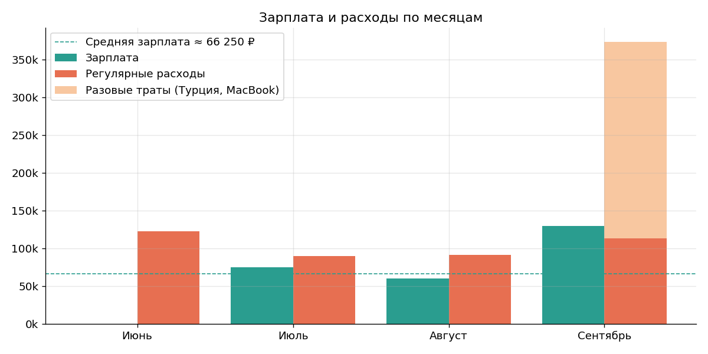
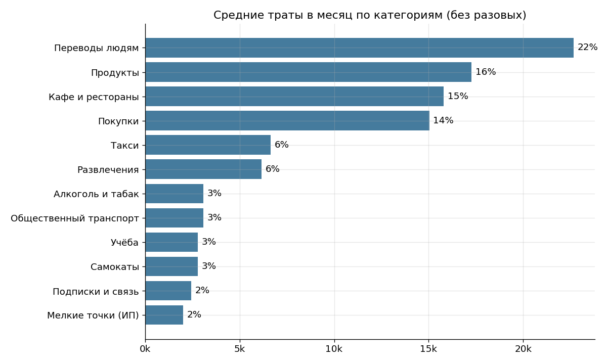
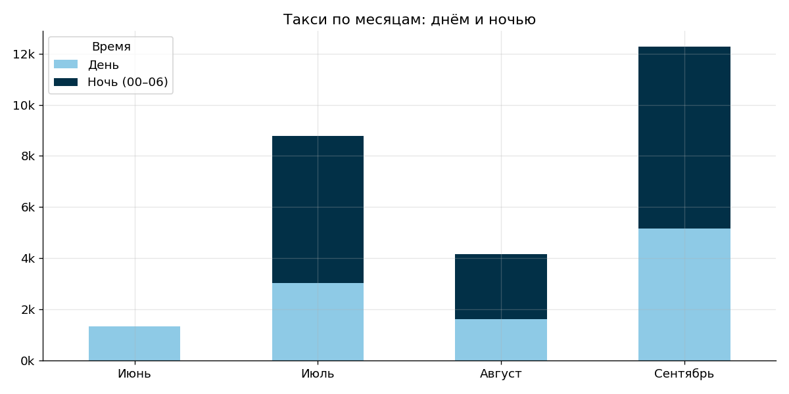
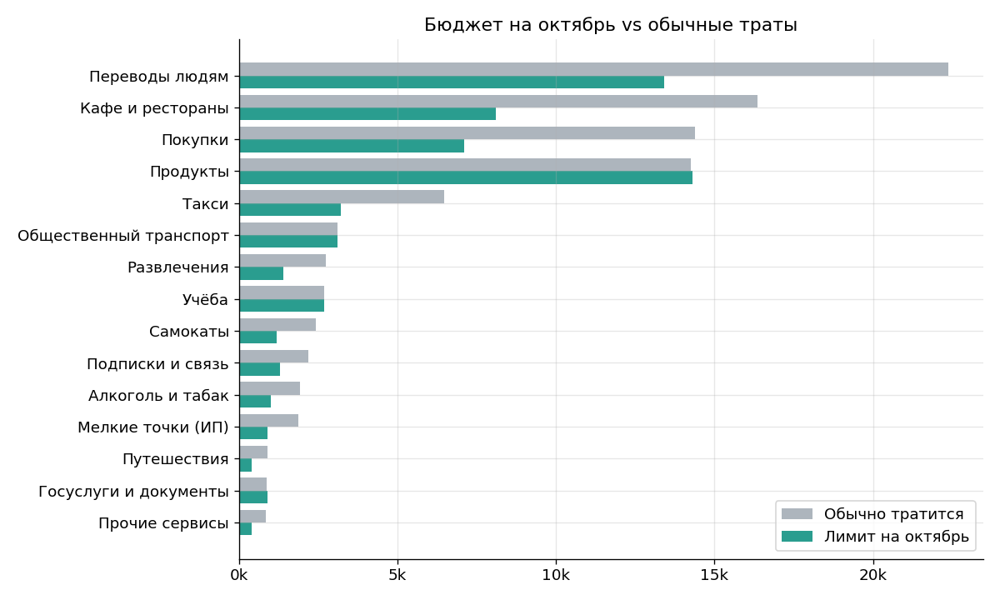

# Анализ личных финансов

Анализ моих трат за июнь — сентябрь 2026 по банковской выписке: куда уходят деньги,
какие привычки сильнее всего влияют на бюджет и сколько можно тратить в октябре,
чтобы уложиться в доход.

**Автор:** Илья Васильев, студент Университета ИТМО

**Стек:** Python, pandas, NumPy, Matplotlib, pdfplumber, Jupyter

## Задача

Выписка из банка показывает только список операций, без категорий и выводов. Хотелось
ответить на вопросы:

- укладываюсь ли я в свой доход и если нет, то насколько выхожу за него;
- на что уходит больше всего денег и как это меняется от месяца к месяцу;
- какие привычки «съедают» бюджет незаметно;
- какой лимит поставить на каждую категорию в следующем месяце.

## Что сделано

1. **Парсинг PDF.** Выписка Т-Банка (49 страниц, 1 115 операций) разбирается по координатам
   колонок с помощью `pdfplumber`. Итоговые суммы сверяются с итогами в самой выписке —
   совпадение до копейки.
2. **Очистка и разметка.** В выписке нет категорий, поэтому каждая операция размечается
   правилами (регулярные выражения по названию магазина): 20 категорий трат и 4 типа операций.
   Переводы между своими счетами исключены: без этого «расходы» были бы завышены вдвое.
3. **Обезличивание.** Номера телефонов, договоров, карт, имена ИП и адреса магазинов удалены.
   В репозитории только обезличенный `data/transactions.csv`.
4. **Анализ.** Денежный поток, структура и динамика трат, проверка пяти гипотез.
5. **Бюджет на октябрь.** Обязательные траты остаются на уровне медианы, гибкие сокращаются
   на единый процент (с ограничением для каждой категории), чтобы уложиться в доход и
   откладывать 10%.

## Главные результаты

**Регулярные расходы в 1,6 раза больше зарплаты**.
Разница покрывалась переводами от других людей и деньгами с собственных счетов.



**Структура трат.** Почти 60% регулярных расходов — переводы людям, кафе, покупки и такси.



**Проверенные гипотезы:**

| # | Гипотеза | Результат |
|---|---|---|
| 1 | Такси дорожает, и в основном это ночные поездки | ✅ рост ~в 9 раз с июня по сентябрь, 58% суммы — поездки после полуночи |
| 2 | Значительная часть трат приходится на ночь и выходные | ✅ 18% трат — с 00 до 06, выходной день дороже буднего на 29% |
| 3 | Еда вне дома обходится почти как продукты | ✅ в среднем ~90% от продуктов, в сентябре — в 1,8 раза больше |
| 4 | Мелкие траты незаметно складываются в крупную сумму | ✅ 63% операций дешевле 300 ₽, ~13,6 тыс. ₽ в месяц |
| 5 | Есть дублирующиеся подписки | ✅ одновременно 5 платных подписок с пересекающимися функциями |



**Бюджет на октябрь.** Чтобы уложиться в доход (~66 тыс. ₽) и откладывать 10%, нужно
сократить траты на ~34 тыс. ₽ в месяц: гибкие категории — примерно вдвое, обязательные
(продукты, транспорт, учёба) остаются без изменений.



## Структура проекта

```
├── data/
│   └── transactions.csv        # обезличенные операции (результат обработки)
├── src/
│   ├── parse_statement.py      # PDF → таблица, сверка итогов
│   └── categorize.py           # категоризация и обезличивание
├── notebooks/
│   └── finance_analysis.ipynb  # анализ, гипотезы, бюджет
├── images/                     # графики для README
└── requirements.txt
```

## Как запустить

```bash
pip install -r requirements.txt

# 1. Разобрать свою выписку (PDF не коммитится — см. .gitignore)
python src/parse_statement.py path/to/statement.pdf

# 2. Разметить категории и обезличить
python src/categorize.py

# 3. Открыть анализ
jupyter notebook notebooks/finance_analysis.ipynb
```

Ноутбук работает и без шагов 1–2: обезличенные данные уже лежат в `data/transactions.csv`.

## Ограничения и что можно улучшить

- Категории проставлены правилами, у небольших точек (ИП) тип определить нельзя.
- Зарплата могла быть сезонной; если доход изменится, достаточно поменять `INCOME` в ноутбуке.
- Данных за 4 месяца мало для учёта сезонности — стоит собрать год.
- Следующий шаг — дашборд (Streamlit / DataLens) с ежемесячным обновлением.
